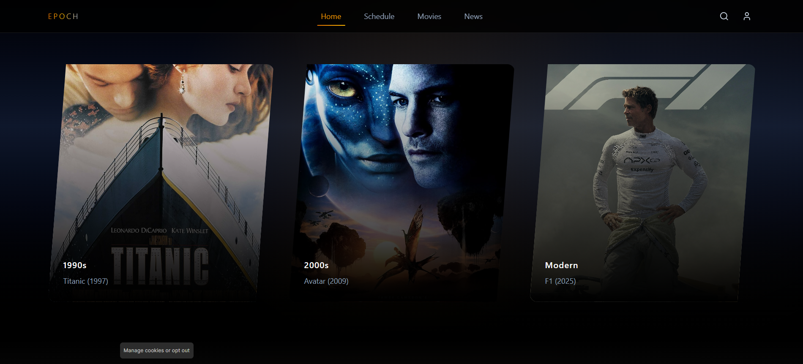

# Epoch  -- Dokumentáció

## 1. Bevezetés

Az **Epoch projekt** célja egy olyan weboldal vizuális és funkcionális
koncepciójának bemutatása, amely a klasszikus mozi korszakát idézi meg.
Inspirációi a 90-es és 2000-es évek filmjei és tipográfiai elemei.\
A célközönség: akik a streaming szolgáltatókat hátrahagyva újra moziban
szeretnék megnézni kedvenc korszakalkotó filmjeiket.

A fő cél egy **vizuálisan gazdag**, **könnyen navigálható**, fiktív
filmeket bemutató oldal, amely trailereket és aktuális mozis kínálatot
is megjelenít.

## 2. Design koncepció

### Főbb jellemzők

-   **Színpaletta:** arany és sötétkék, fekete árnyalatokkal\
-   **Tipográfia:** nagy, karakteres betűtípusok, klasszikus filmplakát
    hangulat\
-   **Képi világ:** nagy háttérképek, finom árnyékolások\
-   **Komponensek:** egységes vizuális stílusú gombok, kártyák,
    navigáció

A design célja: **moziélmény átadása**, miközben az oldal kezelhető és
intuitív marad.

## 3. Főbb oldalak és navigáció

### 3.1 Főoldal -- Korszakválasztás

A főoldalon a felhasználó **három különböző filmes korszak** közül
választhat.

#### Működés

-   **Korszakválasztó gombok:** vizuális stílus váltása\
-   **Tartalomfrissítés:** filmkártyák változnak\
-   **Hangulat:** minden korszak egyedi stílus

### 3.2 Egyéb oldalak

-   About\
-   Movies\
-   Contact

## 4. Vizuális rendszerek és komponensek

### 4.1 Színpaletta

-   Arany (#FFD700)
-   Fekete (#000000)
-   Bordó (#800000)
-   Krém (#F5F5DC)

### 4.2 Tipográfia

-   Klasszikus címsorok\
-   Letisztult törzsszöveg

### 4.3 Ikonok

Navigációs és social ikonok

### 4.4 Grid

12 oszlopos rácsrendszer

### 4.5 Komponensek

-   Gombok\
-   Filmkártyák\
-   Slider

## 5. Interakciók

-   Hover állapotok\
-   Modal trailer lejátszás\
-   Smooth scrolling

## 6. Accessibility

-   Kontrasztos színek\
-   Fókusz és hover jelölések

## 7. Design döntések

-   Klasszikus moziélmény\
-   Moduláris kártyarendszer

## 8. Bővíthetőség

-   Új filmkártyák\
-   Rugalmas grid

## 9. Összegzés

Az Epoch egy klasszikus mozi hangulatát idéző, modulárisan bővíthető
weboldal koncepció.
